import Image from "@/app/ui/image";
import Link from "next/link";
import vsCodePopupImage from "./vscode-popup-desktop.png";
import keysImage from "./keys.png";
import chromePromptImage from "./chrome-prompt.png";

# The Setup

Before the course commences, we need to setup some applications on your computer
to get you started. After that's done, we'll create your first website together!

## Download all the prerequisites

1. Throughout the course, we will switch to using Google Chrome as our browser.
   Go to [google.com/chrome](https://www.google.com/chrome/) and click "Download
   Chrome". Follow the instructions on the download page to install Chrome.

2. We also need an editor to type out the HTML and CSS that we create during the
   course. For that, we use Visual Studio Code (or "VS Code" in short). Go to
   [code.visualstudio.com](https://code.visualstudio.com) and click "Download
   for macOS". Be sure to click the bigger part of the button, not the
   down-facing arrow on the right side.

3. Find the file `VSCode-darwin-universal.zip` in your Downloads folder, double
   click it to unzip it. You should now see a new file:
   `Visual Studio Code.app`. Drag this file to your Applications folder.

## Start Chrome and set it as default browser

To open Google Chrome, press `Command + Spacebar`. Start typing "Chrome" and you
should see the app come up.

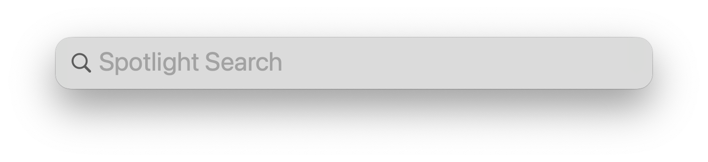
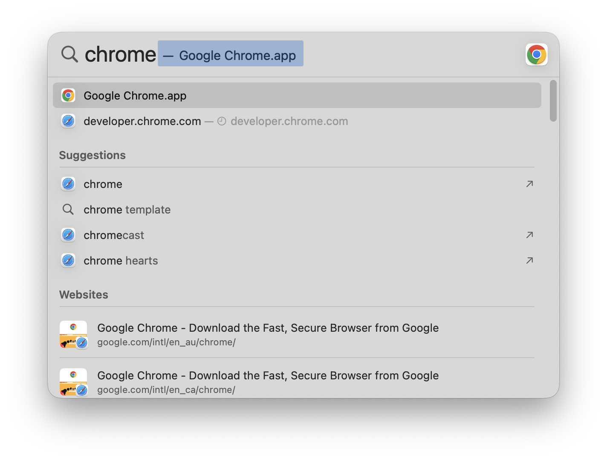

Select it with the arrow keys on your keyboard and press the Return key to
launch to app.

<Image
  className="w-[300px] mx-auto my-12"
  src={keysImage}
  alt="arrow and return key"
/>

You'll be greeted by a prompt asking you to make Chrome your Default Browser.
Make sure the box is ticked as seen below and press "Start Google Chrome".

<Image
  className="w-[600px] mx-auto my-6"
  src={chromePromptImage}
  alt="Screenshot: chrome as default browser"
/>

## Logging onto Slack

Slack is a tool to communicate with your classmates and the teaching staff. It
works like a group chat, like you may know from WhatsApp or Discord.

To share your assignments and questions we'll use Slack.

First, download Slack [using this link](https://slack.com/intl/en-au/downloads).
You should have received a mail from **Slack** inviting you to join "Take2nz
workspace". After you have followed the installation instructions, use the mail
we sent to join our workspace.

<Task title="Introduce Yourself On Slack">
Remember that we said a big part of a successful interview is good writing?

There is one thing above all that helps us get better at writing: practice.

Your first writing assignment: introduce yourself on Slack. Tell your classmates:

* your name
* how many websites you've created before today
* a bit about yourself, like your hobbies or your favorite movie/food/park/car/...

</Task>

## How to take screenshots

During the course, we'll ask you to upload assignments in the form of
screenshots sometimes &mdash; it's an easy way to see what you see and to share
what you're working on. When you encounter a problem, it's a good way for
everyone to see what you're seeing, which helps people understand the problem
you are facing.

To take a screenshot in macOS, you can press `Command + Shift + 4`, then press
the `Spacebar`. A small camera icon appears. Hover over the window that you want
to share. The window turns blue to let you know that this window will be
captured. Click the window to make a screenshot. After a little while, your
screenshot will appear as a file on your Desktop. From there, you can share it
or upload it.

If you're having trouble,
[watch this official video from Apple Support](https://www.youtube.com/watch?v=hOawEk3sKoU)
on how to take screenshots on your computer.

<Task title="Post your first screenshot">
  To test things out, pick a website you like to visit, and open it with Chrome.
  Take a screenshot of your Chrome window, and post it on Slack by dragging the
  Screenshot from your Desktop to our Slack channel.

Optional: if you want, write a sentence or two why you like that website.

</Task>

<Task title="Help Your Classmates" type="group">
  At this point in the class, look around to your classmates. Is anyone stuck?
  See if you can help out. When everyone has posted their introduction and their
  first screenshot, move on to the next lesson.
</Task>

## First steps in VS code

To open VS code, press Command + Spacebar. Start typing "Visual Studio Code" and
you should see the app come up.

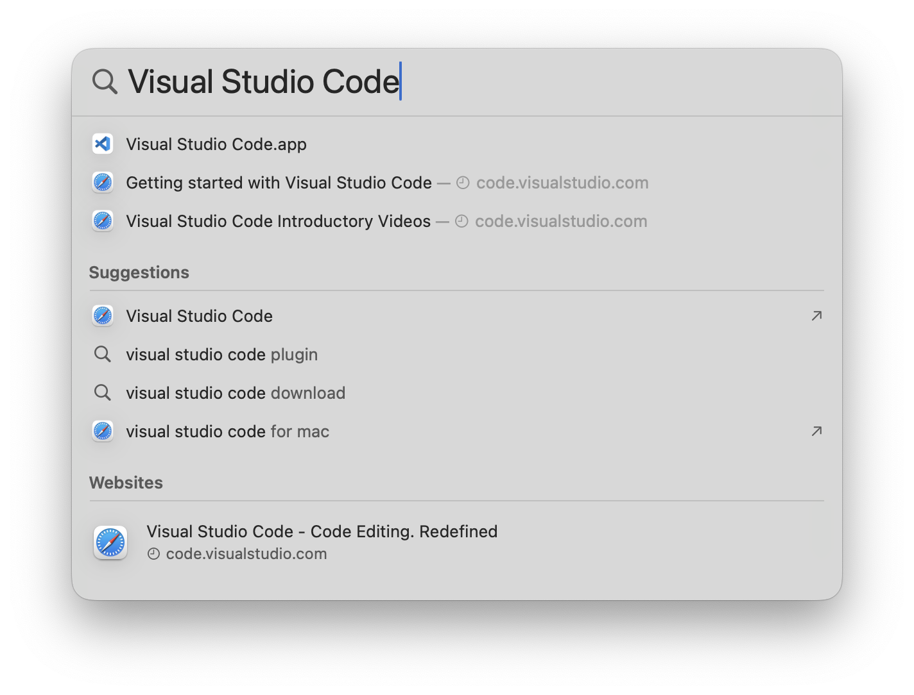

Select it with the arrow keys on your keyboard and press the Return key to
launch to app. You'll be greeted by a new window. First, we'll install an
extension to help us see the websites that we're creating while we are creating
them. This functionality is called _live preview_.

### Installing the live preview extension

An easy way to do or find certain things in VS code is the command palette. Open
the command palette by pressing

`Command + Shift + P`.

A small window will open on top of your editor waiting for your commands. Type
"extensions" and select the "Extensions: Install Extensions" option as depicted
in the screenshot.

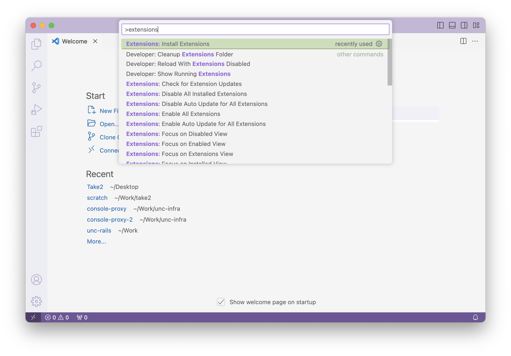

In the extension search bar, type "preview". Find the entry for _Live Preview_
by _Microsoft_ and click on its "Install" button.

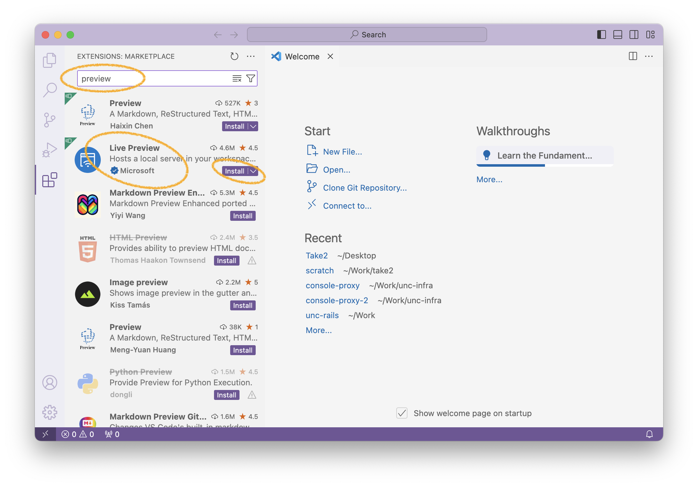

## Creating your first website

We're ready to start. Select the Explorer tab by clicking on the top icon from
the leftmost row of icons. Click "Open Folder".

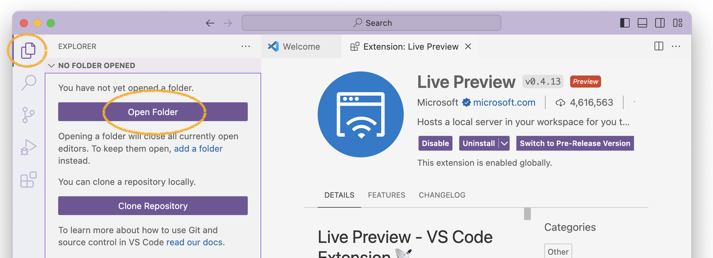

Select your Desktop from the left menu, and click the "New Folder" button. Name
the new folder "Take2", then press "Open".

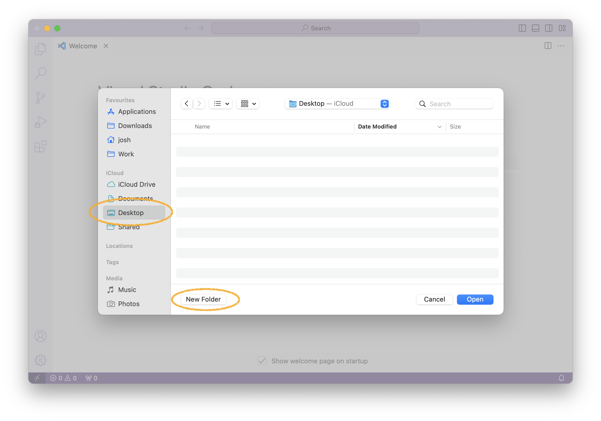

macOS might ask you if VS Code is allowed to access the Desktop. Press "Allow".

<Image
  alt="Screenshot: macOS desktop permission dialogue"
  height={300}
  className="mx-auto"
  src={vsCodePopupImage}
/>

VS Code might then ask you if you want to trust the folder you've just created.
Press "Yes, I trust the authors" to continue.

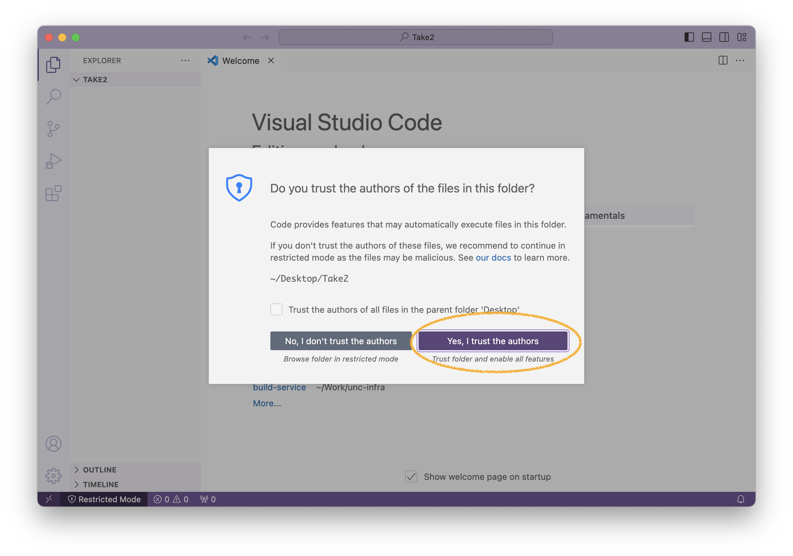

Create a new file and name it "index.html" using the button on the left.

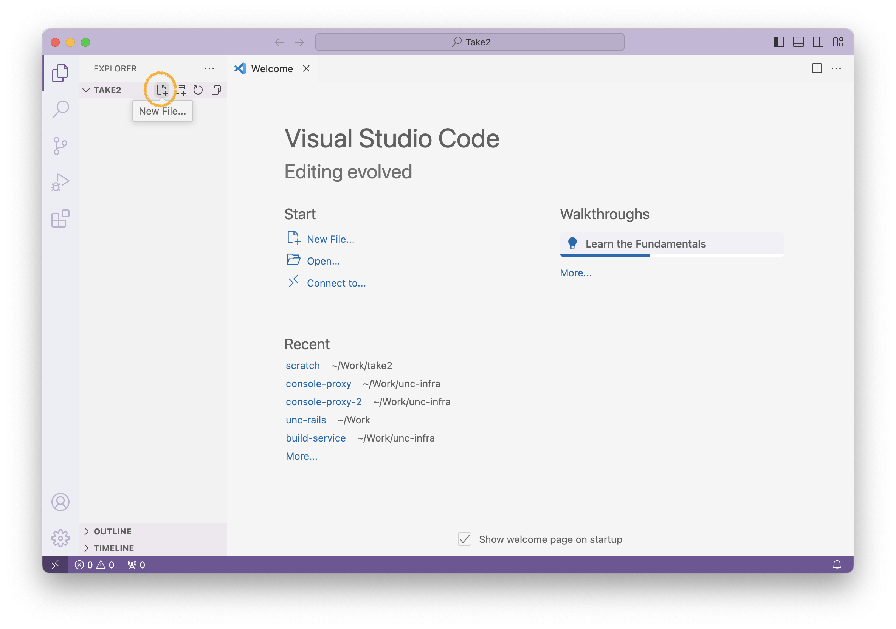

VS Code has already opened the file for us. Click into the editor window and
enter the following text:

`Hello, world!`

Your file should now look like this:
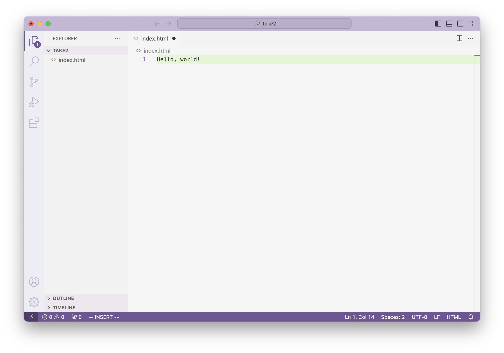

### Seeing your work

Your first website is ready to be viewed. Open the command palette again
(`Command + Shift + P`) and type "live".

Select the entry for "Live Preview: Show Preview (External Browser)" with your
arrow keys and press the Return key.

  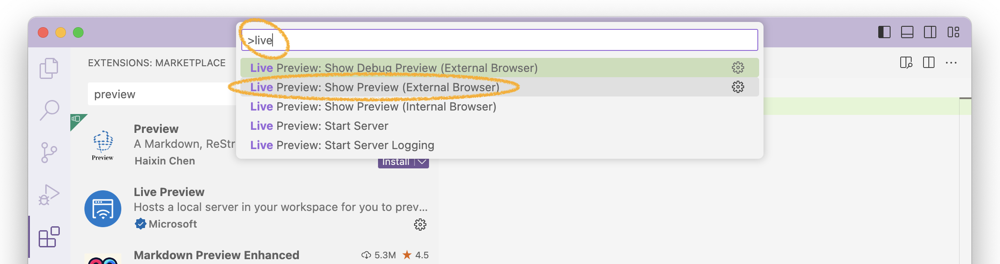

The result should be your website, in a browser:

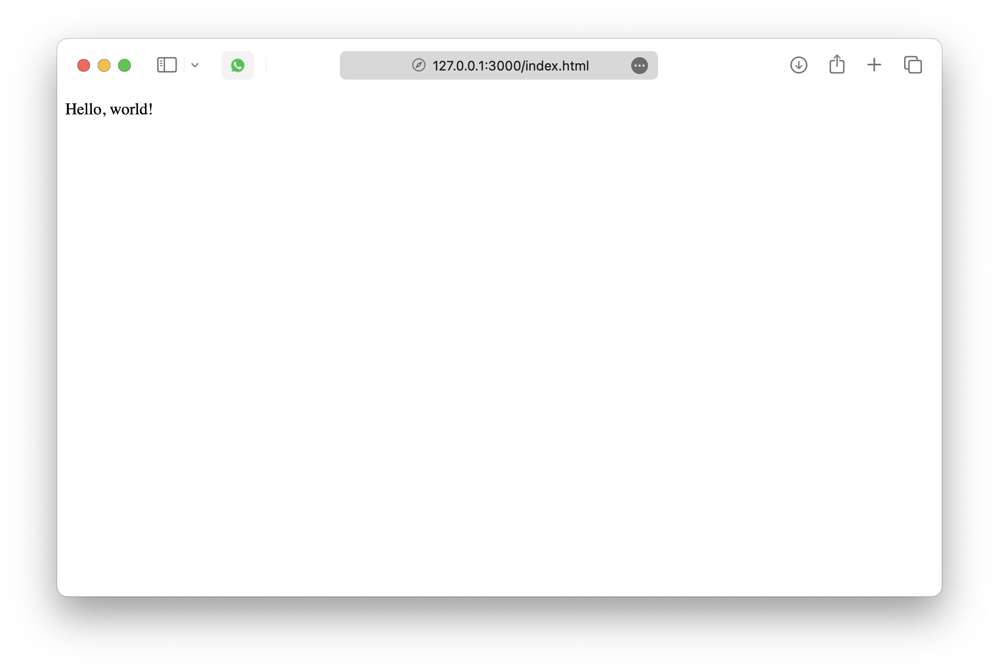

Congratulations. While this isn't the most impressive website _yet_, we're only
getting started today.

<Task title="Help Your Classmates" type="group">
  At this point in the class, look around to your classmates. Is anyone stuck?
  See if you can help out. When everyone can see their first website in the
  browser, move on to the next lesson.
</Task>

  <Link
    href="02-html-intro"
    className="py-2 px-6 bg-blue-600 rounded-lg text-gray-100"
  >
    Continue to next chapter
  </Link>

