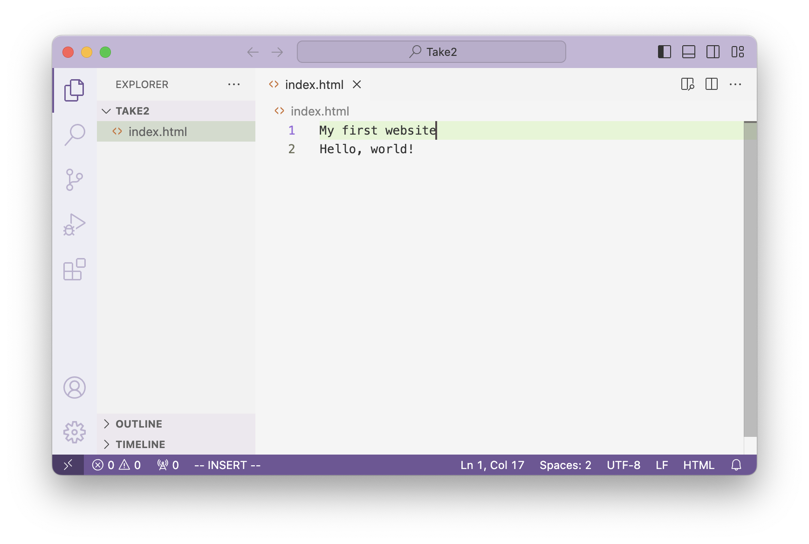
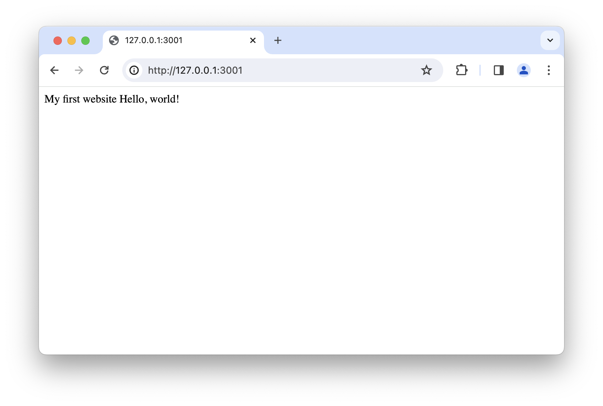
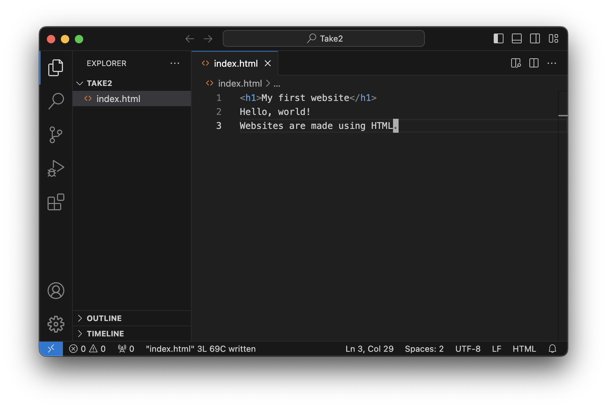
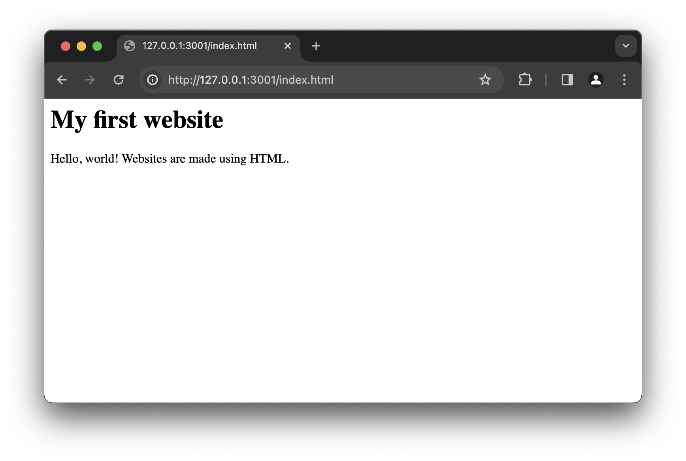
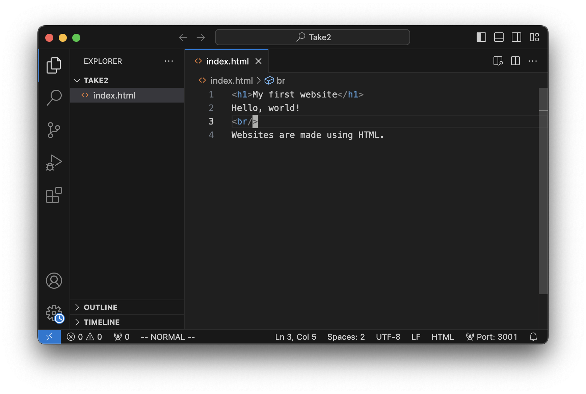
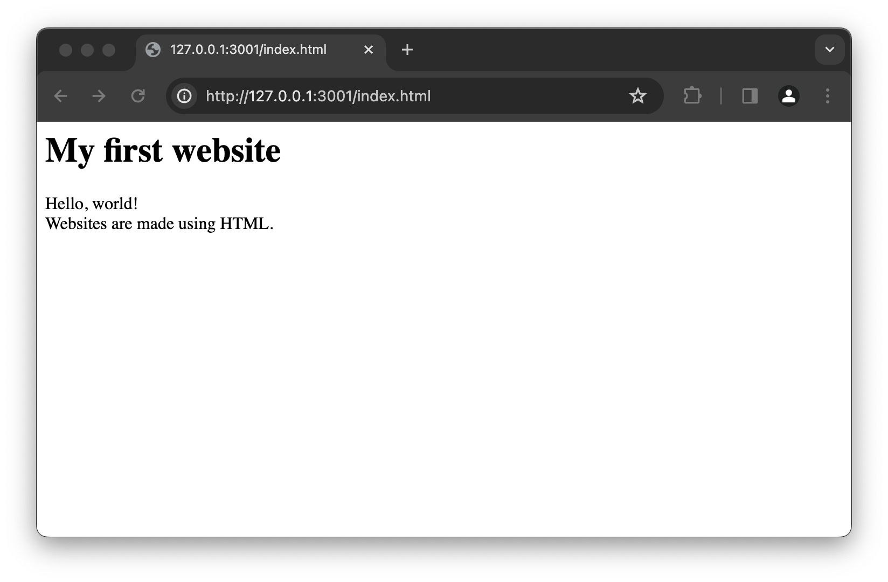
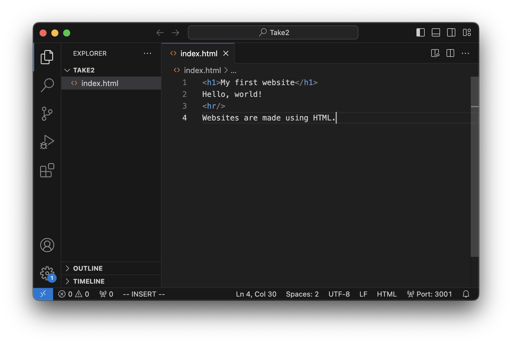
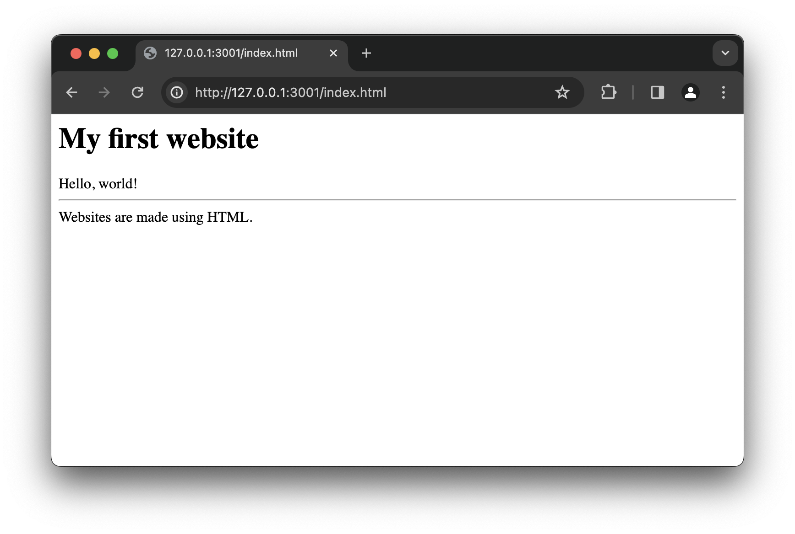
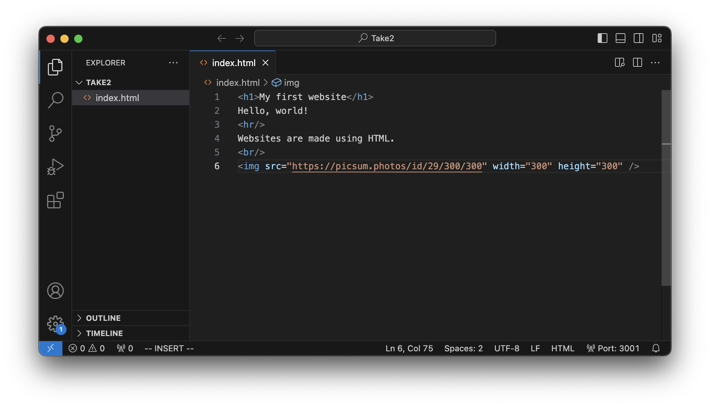
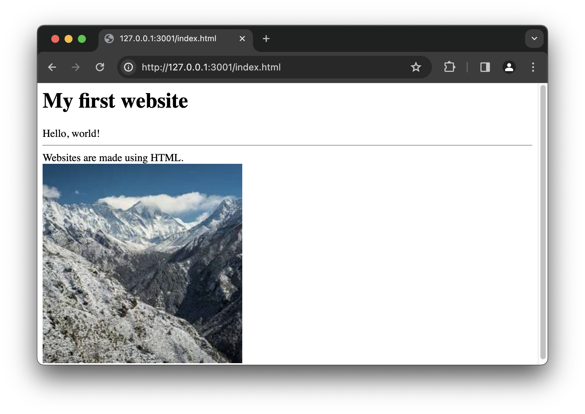

import Image from "@/app/ui/image";

import copyImageAddressImage from "./copy-image-address.png";

# What is a website?

In this lesson, we'll learn how to add different parts to a website, like
headlines, paragraphs, and lists.

After realizing your first website, let's go back a bit and talk about what a
website is. For our purposes, a website consists of three parts: HTML, CSS, and
Javascript. First we will talk about HTML.

## What is HTML?

HTML tells a browser what the website's contents are. In our example website
from the previous lesson, we only wrote a line of text. It told the browser that
this website should contain the text: "Hello, world!"

What if we wanted to add a headline to our website?

Let's add a headline to our website. In VS code, type the words
`My first website` on a line before the words `Hello, world!`. This should be
the result:

<div className="grid grid-cols-1">
  
  
</div>

The browser doesn't know we wanted this to be a headline, so it just displays it
like any other text. We can tell the browser that we wanted it to be a headline
by using an _HTML element_. HTML elements start with an _opening tag_ and end
with a _closing tag_. In between, there's the content.

An opening tag is written by using a 'less than' sign: `<` followed by the tag
name, followed by the 'greater than' sign: `>`

### Example: opening tag

<div className="grid grid-cols-3 my-6 border border-gray-300 rounded-lg p-6">
  <div className="flex flex-col items-center gap-y-2 text-green-500">
    <div className="text-2xl">
      `<`
    </div>
    <div>less than sign</div>
  </div>
  <div className="flex flex-col items-center gap-y-2 text-blue-500">
    <div className="text-2xl">
      `h1`
    </div>
    <div>tag name</div>
  </div>
  <div className="flex flex-col items-center gap-y-2 text-green-500">
    <div className="text-2xl">
      `>`
    </div>
    <div>greater than sign</div>
  </div>
</div>

A closing tag is written by using a 'less than' sign: `<` followed by a slash:
`/`, followed by the tag name, followed by the 'greater than' sign: `>`

### Example: closing tag

<div className="grid grid-cols-4 my-6 border border-gray-300 rounded-lg p-6">
  <div className="flex flex-col items-center gap-y-2 text-green-500">
    <div className="text-2xl">
      `<`
    </div>
    <div>less than sign</div>
  </div>
  <div className="flex flex-col items-center gap-y-2 text-orange-500">
    <div className="text-2xl">
      `/`
    </div>
    <div>slash</div>
  </div>
  <div className="flex flex-col items-center gap-y-2 text-blue-500">
    <div className="text-2xl">
      `h1`
    </div>
    <div>tag name</div>
  </div>
  <div className="flex flex-col items-center gap-y-2 text-green-500">
    <div className="text-2xl">
      `>`
    </div>
    <div>greater than sign</div>
  </div>
</div>

The content is written in between the opening and closing tags. For our example,
we wanted to let the browser know that we would like a headline (tag name: `h1`)
with the content "`My headline`"

### Example: a tag with content

<div className="grid grid-cols-3 my-6 border border-gray-300 rounded-lg p-6">
  <div className="flex flex-col items-center gap-y-2 text-red-500">
    <div className="text-2xl">
      `<h1>`
    </div>
    <div>opening tag</div>
  </div>
  <div className="flex flex-col items-center gap-y-2 text-blue-500">
    <div className="text-2xl">
      `My headline`
    </div>
    <div>content</div>
  </div>
  <div className="flex flex-col items-center gap-y-2 text-red-500">
    <div className="text-2xl">
      `</h1>`
    </div>
    <div className="">closing tag</div>
  </div>
</div>

Let's modify our website to use these tags and see the result. Edit the first
line

```html
My first website
```

and surround it with an opening tag and a closing tag

```html
<h1>My first website</h1>
```

Now it's HTML! Check out the result in your live preview:

<div className="grid grid-cols-1">
   
</div>

Done! The browser knows that "My first website" should be a headline, because we
used the HTML tag for headlines: `<h1>`.

We can use other tags to create other elements. For example, the tag `<u>` is
used to create an underlined element. Try it! Surround any word with the `<u>`
and `</u>` tags to make it underlined. This could look like:

<div className="grid grid-cols-1">
   
</div>

Notice how "world" is now underlined.

<div className="my-6"></div>
<Task title="Exercises" type="research">

Do each of the following on your website:

- Use a `<b>` tag to make a word on your website appear _in bold_.
- Use a `<p>` tag to add a new paragraph at the end of your website. The new
  paragraph should say: "HTML is easy"

After every exercise, take a screenshot and upload it to Slack.

</Task>

<Recap>

There is a difference between 'just text' and HTML. If we write just text, it
looks like this:

```html
Hello, world!
```

If we write HTML instead, it looks like this:

```html
<p>Hello, world!</p>
```

Everything from `<p>` to `</p>` is called an _HTML element_ and `Hello, world!`
is called _the element's content_. There are many different _HTML elements_ with
different meanings:

- `<p></p>` is used for _paragraphs_
- `<h1></h1>` is used for _big headlines_
- `<u></u>` is used for _underlines_
- `<b></b>` is used for _bold print_

</Recap>

## Self-closing tags

Let's add more text to our website and some _spacing_ to make sure a visitor of
our website can read it well. First, we add the text. Add a new line at the end
of your file:

```html
Websites are made using HTML.
```



Now our live preview looks like this:



We want this text to appear on the next line though. To tell our browser that
there should be a line _break_ in between these two sentences, we can use
another HTML element: `<br/>`. You might notice that it does **not** open and
close:

```html
<br></br>
```

Instead, it's a _self-closing_ tag:

```html
<br />
```

Self-closing tags have no content. Let's add our new tag in between the two
lines of text:



And the resulting website:



Great! There are plenty more elements that use _self-closing tags_.

Try `<hr />` instead of `<br />`:



See how it tells the browser to draw a line from left to right:



<Recap>
  Most HTML elements have an _opening tag_ and a _closing tag_. The content
  goes in between these two _tags_.

```html
<h1>This is a headline, with opening and closing tag</h1>
<p>This is a paragraph, with opening and closing tag</p>
```

Some HTML elements are _self-closing_ instead because they don't have any
content. They use a slash at the end of the _opening tag_ and don't use a
_closing tag_.

```html
<hr />
<br />
```

- `<hr/>` is a _horizontal rule_
- `<br/>` is a line _break_

</Recap>

## HTML Attributes

### The anchor element `<a>`

Let's look at another HTML element, the anchor `<a></a>`. When we write this:

```html
<a>Link to google.com</a>
```

it produces a link:

<a className="underline underline-offset-2 cursor-pointer">
  Link to google.com
</a>
<div className="mb-6"></div>

However, when we click this link (try it!), nothing happens. We have told the
browser that we want a link by using the `<a></a>` tag. We have told the browser
that the link text should be "Link to google.com", by putting that as the tag
content. But, the browser doesn't know yet _where it should send us_ when we
click the link! To add this information, we'll need an _HTML attribute_,
specifically "`href`". This is written like so:

```html
<a href="google.com">Link to google.com</a>
```

<div className="grid grid-cols-6 my-6 border border-gray-300 rounded-lg p-6">
  <div className="flex flex-col items-center">
    <div className="text-2xl">
      `<a`
    </div>
    <div></div>
  </div>
  <div className="flex flex-col items-center text-red-500">
    <div className="text-2xl">
      `href`
    </div>
    <div>attribute&nbsp;name</div>
  </div>
  <div className="flex flex-col items-center text-green-500">
    <div className="text-2xl">
      `=`
    </div>
    <div></div>
  </div>
  <div className="flex flex-col items-center text-blue-500">
    <div className="text-2xl">
      `"google.com"`
    </div>
    <div>attribute&nbsp;value</div>
  </div>
  <div className="flex flex-col items-center">
    <div className="text-2xl">
      `>`
    </div>
    <div className=""></div>
  </div>
  <div className="flex flex-col items-center">
    <div className="text-2xl">
      `...`
    </div>
    <div className=""></div>
  </div>
</div>

<Task title="Add links to your page">
To flex your new skills, add three links to your page. They could be
links to your favorite websites, to websites you think are useful,
or to websites you use the most like Google, Yahoo, or Gmail.

When you're done, post a screenshot on Slack.

</Task>

## Images

What is a website without images? Exactly, it's _boring_. Let's add some images
to our website using the `` tag. It's self-closing, and it has an
attribute to tell the browser _where_ to get the image.

### Example: `` tag

```html

```

There's a lot to unpack here. First, we're creating a self-closing tag:
``. Then, we're giving it an _HTML attribute_ named `src` with a value of
`https://picsum.photos/id/29`. As we said earlier, the `src` attribute tells our
browser where to get the image. You can go to this address directly! Try it,
open a new tab in your browser and go to `https://picsum.photos/id/29` &mdash;
your browser will show this picture:


If we wanted to send our visitors _away_ from our website, we could use an
`<a></a>` tag to link them to the image. But we want the image to appear _on our
website_ without sending the user away. That's why we're using the ``
element.

Let's add a break to our website now, and then the image. We will use two more
attributes on `` besides `src`: `width` and `height`. As you might guess,
`width` and `height` tell the browser how big to show the image. Add this to the
bottom of our HTML:

```html
<br />

```



As a result, our visitors can see the image on our website:



<Task title="Add images to your page">
You learned something new again &mdash; how to add images to a website 
&mdash; so let's add some images to your website.

Pick a topic (food, music, whatever). Using
[Google image search](https://images.google.com), find three images you would
like to add to your website. To find their source for the `src` attribute, when
you've found an image you like, right-click on it and select "Copy Image
Address". You can now paste the text into your `src` attribute.

<Image
  width={300}
  src={copyImageAddressImage}
  alt="Screenshot: copy image address"
  className="ml-4 mb-4"
/>

When you're done, post a screenshot on Slack.

</Task>

<Recap>
We learned about HTML attributes like `href`, `src`, `width` and `height`

```html
<a href="google.com">Go to Google</a>
```

- The `<a></a>` tag links visitors to a different website
- `href="google.com"` - the link should take us to "`google.com`"

Every tag takes different attributes. The `<a></a>` tag takes a `href` attribute
to show where the link is pointing. An `` tag takes different attributes:

```html

```

- The `` tag embeds images in our website
- The `` tag is _self-closing_
- `src="https://picsum.photos/200/300"` - the image is _sourced_ from the
  website
  <a href="https://picsum.photos/200/300" className="underline underline-offset-2">https://picsum.photos/200/300</a>
- `width="300"` - the image should be shown 300 pixels wide
- `height="300"` - the image should be shown 300 pixels tall

</Recap>

# More resources

If you'd like to hear more explanations around our starter topic, give
[Chapter 1 of this video](https://youtu.be/G3e-cpL7ofc?si=FbbcMALIGcFgdWLU&t=116)
a watch.
