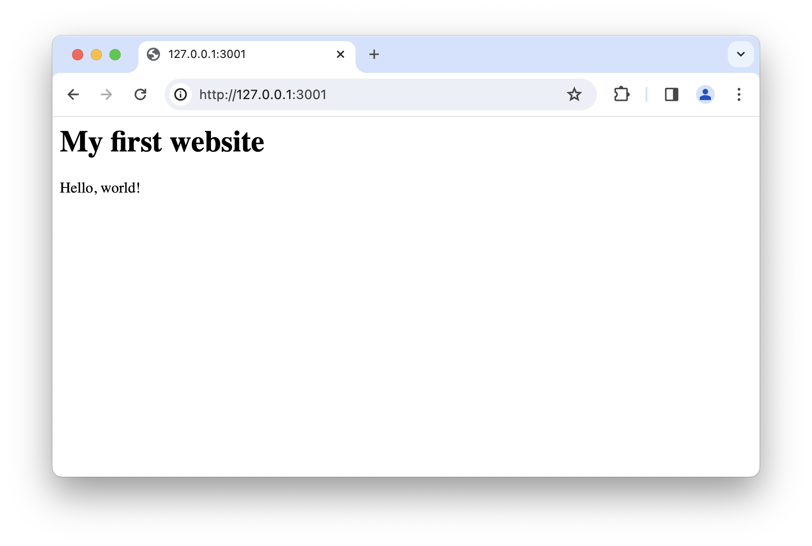
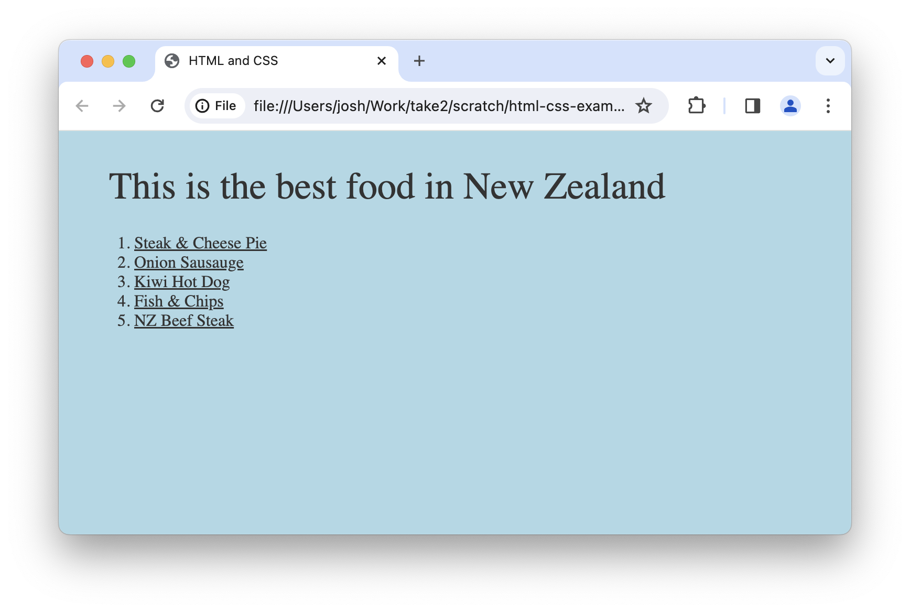
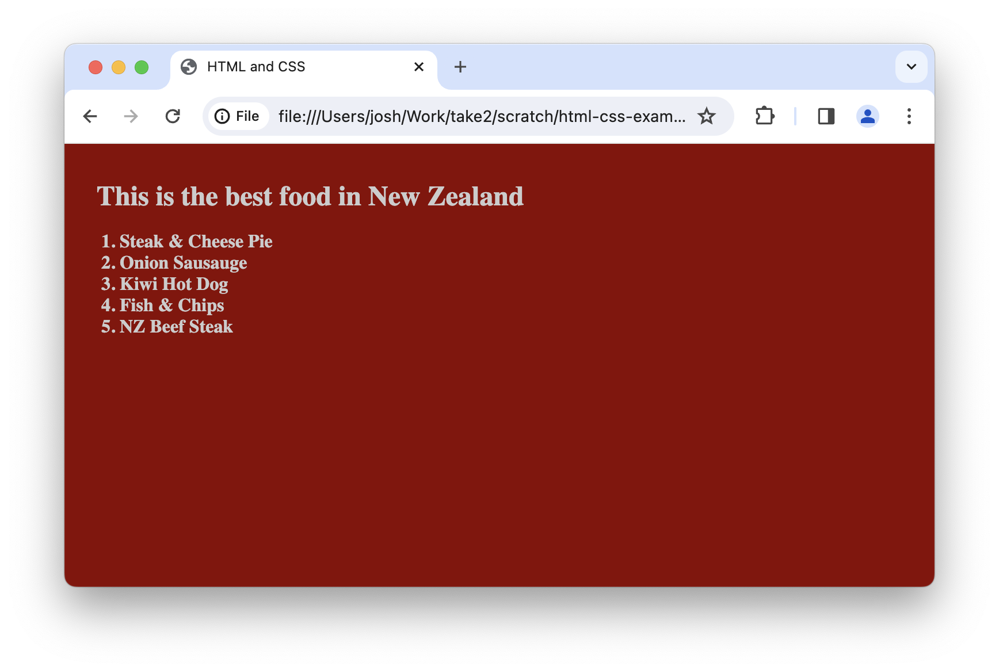
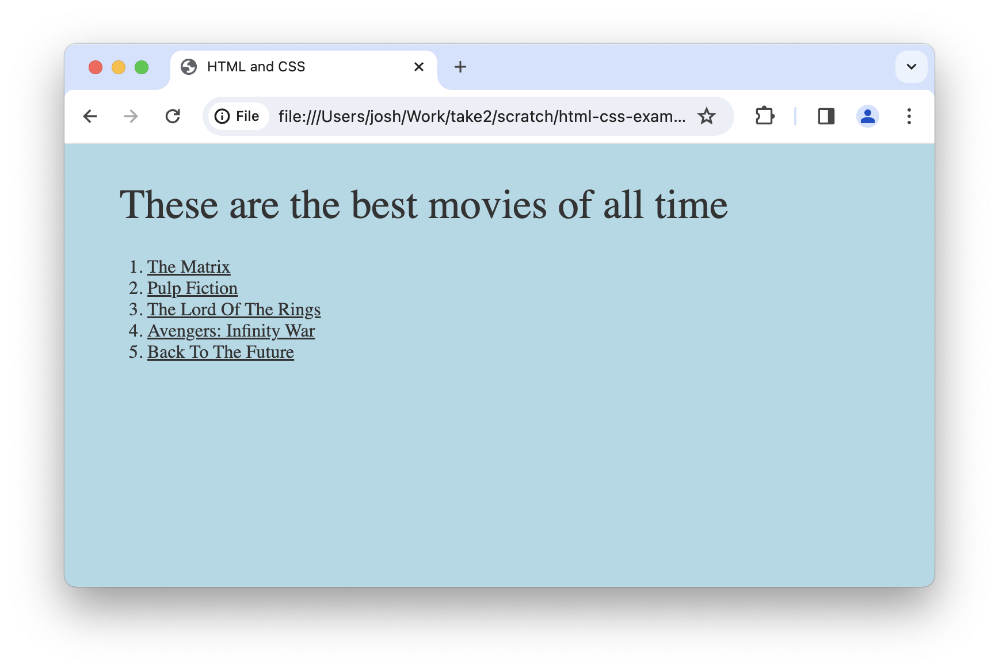

import { BeakerIcon, UsersIcon } from "@heroicons/react/24/outline";

import TaskPrompt from "@/app/ui/task_prompt";
import Recap from "@/app/ui/recap";

<Task title="Recap: Group Exercise" type="group">
  The team leader sets a timer for five minutes. During this time, find
  out which other tags besides `<h1>` can be used for
  headlines. When five minutes are up, the team leader asks everyone to
  name one, collects the answers, and posts them to our Slack.
</Task>

# CSS

After talking about *HTML*, which tells the browser what content we want
on our website, we will now talk about *CSS*, which
tells the browser how this content should look. Let's start with our website that we created in the previous lesson:

In VS code, create a new file called "index.css"

## CSS

CSS describes how the website content should look, but not what the
content is. The example website uses CSS to tell the browser:
headlines (e.g. &quot;This is the best food...&quot;) should be bigger
than the rest of our text. CSS also tells the browser that the list
items like &quot;Steak &amp; Cheese Pie&quot; should be underlined.

## Javascript

Javascript (or &quot;JS&quot; in short) tells us about the website's
interactive behavior, if any. In this starter course, we don't have to
worry about Javascript yet. In our example website, there is no
Javascript used yet.

## The Browser

The browser (like Chrome or Safari) brings it all together: it takes
our HTML, CSS, and JS, and displays our website.

### Example: Same HTML, different CSS

Note how the content does not change, the same words are on both
websites, but the style is different.

  
  

### Example: Same CSS, different HTML

  Note how the content changes and the words are different, but the
  style is identical.

  
  

