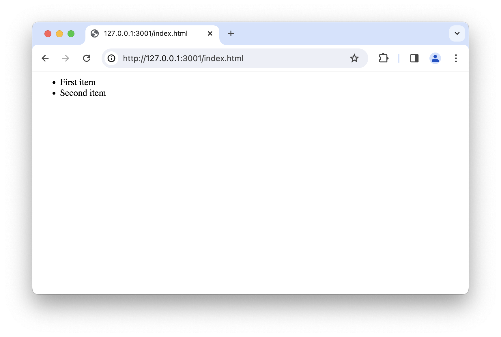

import { ArrowRightIcon } from "@heroicons/react/24/solid";

# Practise your new HTML skill

In this lesson, we'll put your new HTML skills to work. You'll repeat what was
learned in the past lessons, build on it, and use it in practice. This is a
great way to fortify your new knowledge.

<Recap title="HTML elements">

Remember that _HTML elements_ are used to tell the browser what the text that we
write means? We used a `<h1></h1>` tag in the last lesson to mark something as a
headline.

  <div className="grid grid-cols-2 gap-4 mb-6">
    <div className="flex flex-col">
      {/* <!-- prettier-ignore --> */}
      ```html
      A headline
      ```
      <span className="text-sm -mt-5">This is not HTML. It's just text.</span>
    </div>
    <div className="flex flex-col">
      ```html
      <h1>A headline</h1>
      ```
      <span className="text-sm -mt-5">This is HTML.</span>
    </div>
  </div>

Whenever we _open_ a tag (`<h1>`), we must then _close_ it later (`</h1>`)
We can have different tags for different meanings. 
- `<h1></h1>` is a big headline. 
- `<h2></h2>` is a smaller headline. 
- `<u></u>` will underline everything in-between. 
- `<a href="X">Y</a>` makes a link to yahoo.com<br/>
  `<a href="https://yahoo.com">Go to yahoo.com</a>` makes a link to yahoo.com<br/>
- `Go to yahoo.com</a>` makes a link to yahoo.com

</Recap>

## HTML skeleton

We can put _HTML elements_ inside other _HTML elements_. In the last lesson, we
used an `<u></u>` tag to underline the word _hello_.

When we start a new website, we're expected to tell the browser that we're about
to write HTML. To that end, most websites start with these two tags: `html` and
`body`

{/* prettier-ignore */}
```html
<html>
  <body>
  </body>
</html>
```

So instead of just putting our _HTML elements_ in a blank file, we write them
inside this skeleton. See how we can write the two tags on the left _inside_ the
`<html>` and `<body>` tags on the right.

<div className="grid grid-cols-[minmax(0px,_1fr)_50px_minmax(0px,_1fr)] items-center">
  ```html
  <h1>This is a headline</h1>
  <p>This is a paragraph</p>
  ```
  <ArrowRightIcon className="w-[25px] justify-self-center" />
  ```html
  <html>
    <body>
      <h1>This is a headline</h1>
      <p>This is a paragraph</p>
    </body>
  </html>
  ```
</div>

<Task title="Challenge #1">
  Given this website:

```html
<h1>Attention</h1>
<p>There will be no ANZAC day this year.</p>
```

1. Change the headline to be a `<h2>` tag instead of a `<h1>`.
2. Make the headline polite.

Post your code solution on Slack.

</Task>

<Task title="Challenge #2">
  Given this website:

```html
<h1>Attention</h1>
<p>There will be no ANZAC day this year.</p>
```

wrap the existing tags into a **HTML skeleton** (`<html>` and `<body>`).

Post your code solution on Slack.

</Task>

## Lists

Whenever we want the browser to display a list of items, we can use the
`<ul></ul>` tags or the `<ol></ol>` tags. Inside them, we use the `<li></li>`
tags to add individual items.

Example:

```html
<ul>
  <li>First item</li>
  <li>Second item</li>
</ul>
```



<Task title="Challenge #3">
  Given this website:

```html
<html>
  <body>
    <h2>My favorite foods</h2>
    <ul>
      <li>Pizza</li>
    </ul>
  </body>
</html>
```

1. Paste this website into your editor.
2. Preview the result.
3. Add another food to the list, _before_ pizza
4. Add another food to the list, _after_ pizza

Post your code solution on Slack.

</Task>

<Task title="Challenge #4">
  Given this website:

```html
<html>
  <body>
    <h2>My favorite foods</h2>
    <ul>
      <li>Peanut Butter</li>
      <li>Pizza</li>
      <li>Hot Dogs</li>
    </ul>
  </body>
</html>
```

1. Paste this website into your editor.
2. Preview the result.
3. Now change the `<ul></ul>` tag to an `<ol></ol>` tag.
4. Notice what changed between the two versions.
5. Summarize the differences between the `<ul></ul>` and `<ol></ol>` tags and
   share your analysis on Slack.

Post your code solution on Slack.

</Task>

## Bugs

Anytime something in a computer doesn't work like we expect it to, we call that
a "bug". Sometimes it's up to us to "fix" these bugs.

One thing that tends to go wrong when we write HTML are "typos", which means
mistakes when we type, or when we copy & paste.

<Task title="Challenge #5">
  Given this website:

```html
<html>
    <h1>About me<h1>
    <h2>My favorite foods</h1>
    <p>I don't have any favorite foods.</p>
  </body>
</htl>
```

There are _four bugs_ in this website. The first one is:

1. After `<html>` and before `<h2>`, the `<body>` opening tag is missing.

Can you spot the other three bugs? Post them on Slack.

</Task>

<Task title="Challenge #6">
  Given this website:

```html
<html>
  <body>
    <h1>About me</h1>
    <h1>My favorite foods</h2>
    <p>I don't have any favorite foods.<p>
</htmll>
```

There are _four bugs_ in this website. Find them and post them on Slack.

</Task>

<Task title="Challenge #7">
  Given this website:

```html
<html>
  <body>
    <ol>
      <l>Great</li>
      <li>Good</l>
      <li>Average</li>
      <li>Not so good<li>
      <il>Bad</li>
    </ul>
  </body>
</html>
```

There are _four bugs_ in this website. Find them and post them on Slack.

</Task>
